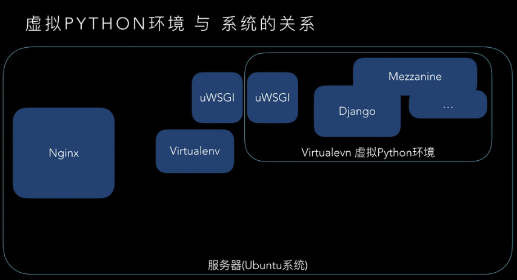
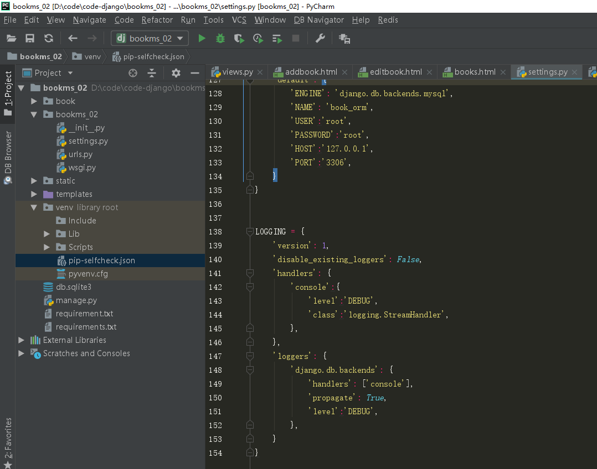
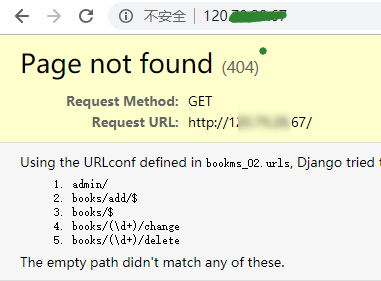

Django项目部署

## 1. 介绍

&#160; &#160; &#160; &#160;uWSGI是一个Web服务器，它实现了WSGI协议、uwsgi、http等协议。Nginx中HttpUwsgiModule的作用是与uWSGI服务器进行交换。
要注意 WSGI / uwsgi / uWSGI 这三个概念的区分。

&#160; &#160; &#160;&#160;WSGI是一种Web服务器网关接口。它是一个Web服务器（如nginx，uWSGI等服务器）与web应用（如用Flask框架写的程序）通信的一种规范。
&#160; &#160; &#160; &#160;uwsgi是一种线路协议而不是通信协议，在此常用于在uWSGI服务器与其他网络服务器的数据通信。而uWSGI是实现了uwsgi和WSGI两种协议的Web服务器。

&#160; &#160; &#160; &#160;uwsgi协议是一个uWSGI服务器自有的协议，它用于定义传输信息的类型（type of information），每一个uwsgi packet前4byte为传输信息类型描述，它与WSGI相比是两样东西。

## 2. 原理




1. 首先客户端请求服务资源，
1. nginx作为直接对外的服务接口,接收到客户端发送过来的http请求,会解包、分析，
1. 如果是静态文件请求就根据nginx配置的静态文件目录，返回请求的资源，
1. 如果是动态的请求,nginx就通过配置文件,将请求传递给uWSGI；uWSGI 将接收到的包进行处理，并转发给wsgi，
1. wsgi根据请求调用django工程的某个文件或函数，处理完后django将返回值交给wsgi，
1. wsgi将返回值进行打包，转发给uWSGI，
1. uWSGI接收后转发给nginx,nginx最终将返回值返回给客户端(如浏览器)。


## 3. windows端操作
### 3.1 项目打包




### 3.2 导出依赖

```
pip freeze > requirements.txt  （windows我测试失败。我直接pip list 然后编辑文件到 requirements.txt）
格式如下：
(venv) [root@leco bookms]# cat requirements.txt
asn1crypto==0.24.0
cffi==1.11.5
cryptography==2.4.2
Django==2.1.4
idna==2.8
pycparser==2.19
PyMySQL==0.9.2
pytz==2018.7
setuptools==39.1.0
six==1.12.0
```
### 3.3 上传到服务器

最好是放在nginx的指定的家目录下，我放在了如下路径。
```
(venv) [root@leco bookms]# pwd
/usr/share/nginx/html/bookms
```

## 4. Linux端操作
### 4.1 安装nginx

- ubuntu 系统
```
[root@leco etc]# apt-get install nginx 
```

- centos系统
```
[root@leco etc]# yum install nginx 
```

### 4.2 安装python
#### 4.2.1 下载

```
[root@leco ~]# wget https://www.python.org/ftp/python/3.7.1/Python-3.7.1.tgz
```
#### 4.2.2 解压

```
[root@leco ~]# tar xf Python-3.7.1.tgz
```

#### 4.2.2 编译安装

```
[root@leco ~]# cd Python-3.7.1
[root@leco Python-3.7.1]#  ./configure && make && make install
```

#### 4.2.3 测试

```
[root@leco Python-3.7.1]# python3 -V
Python 3.7.1
[root@leco Python-3.7.1]# pip3 -V
pip 10.0.1 from /usr/local/lib/python3.7/site-packages/pip (python 3.7)
```

### 4.3 安装虚拟环境

```
[root@leco Python-3.7.1]# pip3 install virtualenv
```

### 4.4 虚拟环境
找到项目的根目录，删除windows自带的虚拟环境，重新创建和安装包

```
[root@leco bookms]# ls
book  bookms_02  db.sqlite3  manage.py  requirements.txt  static  templates  venv
```
删除windows的虚拟环境，若是本身在linux上的就不用删除。Windows的有点问题

```
[root@leco bookms]# rm -rf venv
[root@leco bookms]# virtualenv venv
```
进入虚拟环境，此时安装的包都是在本项目的虚拟环境中。

```
[root@cairui bookms]# source venv/bin/activate
(venv) [root@cairui bookms]#
```

进入虚拟环境后前面会多(venv),(venv)是虚拟环境的名字。

```
(venv) [root@leco bookms]# pip install -r requirements.txt
(venv) [root@leco bookms]# pip list
Package      Version
------------ -------
asn1crypto   0.24.0
cffi         1.11.5
cryptography 2.4.2
Django       2.1.4
idna         2.8
pip          18.1
pycparser    2.19
PyMySQL      0.9.2
pytz         2018.7
setuptools   39.1.0
six          1.12.0
wheel        0.32.3
```

## 5. 配置
### 5.1 访问设置
```
(venv) [root@leco bookms]# vim bookms_02/settings.py
ALLOWED_HOSTS = ['*']
```

!!! quote "地址限制"
   星号表示不限制访问的IP地址


### 5.2 数据配置
```
(venv) [root@leco bookms]# vim bookms_02/settings.py
DATABASES = {
    'default': {
        'ENGINE': 'django.db.backends.mysql',
        'NAME': 'book_orm',
        'USER':'root',
        'PASSWORD':'root',
        'HOST':'127.0.0.1',
        'PORT':'3306',
    }
}
```

!!! note "配置参数详解" 
    ```python
    'ENGINE': 'django.db.backends.mysql', 使用mysql数据库
    'NAME': 'book_orm',                   指定数据库名，需要手动先创建
    'USER':'root',                        数据库登录用户名
    'PASSWORD':'root',                    数据库登录用户名对应的密码
    'HOST':'127.0.0.1',                   mysql数据库的IP地址。
    'PORT':'3306',                        mysql端口
    ```
    
## 6.创建数据库
### 6.1 创建数据库

```
[root@leco Python-3.7.1]# mysql -uroot -p
Enter password:
Welcome to the MySQL monitor.  Commands end with ; or \g.
Your MySQL connection id is 4
Server version: 5.6.42 MySQL Community Server (GPL)

Copyright (c) 2000, 2018, Oracle and/or its affiliates. All rights reserved.

Oracle is a registered trademark of Oracle Corporation and/or its
affiliates. Other names may be trademarks of their respective
owners.

Type 'help;' or '\h' for help. Type '\c' to clear the current input statement.
mysql> create database book_orm DEFAULT CHARACTER SET utf8 COLLATE utf8_general_ci;
```
### 6.2 数据迁移
数据表创建

```
(venv) [root@leco bookms]# ls
book  bookms_02  db.sqlite3  manage.py  requirements.txt  static  templates  venv
(venv) [root@leco bookms]# python3 manage.py makemigrations
(venv) [root@leco bookms]# python3 manage.py migrate
```

!!! tip "区别"
    ```python
    python manage.py makemigrations 
    makemigrations会在当前目录下生成一个migrations文件夹，该文件夹的内容就是数据库要执行的内容 
    
    python manage.py migrate 
    migrate就是执行之前生成的migrations文件，这一步才是操作数据库的一步 
    ```

### 6.3 测试

```
(venv) [root@leco bookms]# python3 manage.py runserver 0.0.0.0:7000
Performing system checks...

System check identified no issues (0 silenced).
(0.000) SELECT @@SQL_AUTO_IS_NULL; args=None
(0.000) SET SESSION TRANSACTION ISOLATION LEVEL READ COMMITTED; args=None
(0.001) SHOW FULL TABLES; args=None
(0.003) SELECT `django_migrations`.`app`, `django_migrations`.`name` FROM `django_migrations`; args=()
December 24, 2018 - 07:16:02
Django version 2.1.4, using settings 'bookms_02.settings'
Starting development server at http://0.0.0.0:7000/
Quit the server with CONTROL-C.
新开一个终端测试
[root@leco Python-3.7.1]# curl 127.0.0.1:7000
<!DOCTYPE html>
<html lang="en">
<head>
  <meta http-equiv="content-type" content="text/html; charset=utf-8">
  <title>Page not found at /</title>
  <meta name="robots" content="NONE,NOARCHIVE">
  <style type="text/css">
    html * { padding:0; margin:0; }
    body * { padding:10px 20px; }
    body * * { padding:0; }
    body { font:small sans-serif; background:#eee; color:#000; }
    body>div { border-bottom:1px solid #ddd; }
    h1 { font-weight:normal; margin-bottom:.4em; }
    h1 span { font-size:60%; color:#666; font-weight:normal; }
    table { border:none; border-collapse: collapse; width:100%; }
    td, th { vertical-align:top; padding:2px 3px; }
    th { width:12em; text-align:right; color:#666; padding-right:.5em; }
    #info { background:#f6f6f6; }
    #info ol { margin: 0.5em 4em; }
    #info ol li { font-family: monospace; }
    #summary { background: #ffc; }
    #explanation { background:#eee; border-bottom: 0px none; }
  </style>
</head>
<body>
  <div id="summary">
    <h1>Page not found <span>(404)</span></h1>
    <table class="meta">
      <tr>
        <th>Request Method:</th>
        <td>GET</td>
      </tr>
      <tr>
        <th>Request URL:</th>
        <td>http://127.0.0.1:7000/</td>
      </tr>

    </table>
  </div>
  <div id="info">

      <p>
      Using the URLconf defined in <code>bookms_02.urls</code>,
      Django tried these URL patterns, in this order:
      </p>
      <ol>

          <li>

                admin/


          </li>

          <li>

                books/add/$


          </li>

          <li>

                books/$


          </li>

          <li>

                books/(\d+)/change


          </li>

          <li>

                books/(\d+)/delete


          </li>

      </ol>
      <p>

        The empty path didn't match any of these.
      </p>

  </div>

  <div id="explanation">
    <p>
      You're seeing this error because you have <code>DEBUG = True</code> in
      your Django settings file. Change that to <code>False</code>, and Django
      will display a standard 404 page.
    </p>
  </div>
</body>
</html>
```
以上测试OK。

### 6.4 创建配置文件

```
(venv) [root@leco bookms]# mkdir conf
(venv) [root@leco bookms]# mv bookms.conf socket.xml uwsgi.ini uwsgi_params conf/
(venv) [root@leco conf]# cat bookms.conf
upstream django {
    # server unix:///path/to/your/mysite/mysite.sock; # for a file socket
    # 设置本地服务的端口
    server 127.0.0.1:8000; # for a web port socket (we'll use this first)
}
server{
            listen 80;
            server_name localhost;
            charset utf-8;
            access_log off;
            location /static {
                alias /usr/share/nginx/html/bookms/static; # 要与之前django的setting.py中添加的static静态文件转移目录一致
            }
            location / {
		        uwsgi_pass  django;
       	 	    include     /usr/share/nginx/html/bookms/conf/uwsgi_params;
            }

}

(venv) [root@leco conf]# cat socket.xml
<uwsgi>
    <socket>:8000</socket>
    <chdir>/usr/share/nginx/html/HelloWorld</chdir>
    <module>hello.wsgi</module>
    <processes>4</processes> <!-- 进程数 -->
    <daemonize>uwsgi.log</daemonize>
</uwsgi>

(venv) [root@leco conf]# cat uwsgi.ini
[uwsgi]
# Django-related settings
# Django项目本地端口
socket = :8000
# 项目根目录位置
chdir = /usr/share/nginx/html/bookms
# wsgi.py文件在项目的中的相对位置
wsgi-file = /usr/share/nginx/html/bookms/bookms_02/wsgi.py
module =bookms.wsgi
# 进程设置，无需变动
# master
master = true
# maximum number of worker processes
# 启动4个uwsgi进程
processes = 4
# ... with appropriate permissions - may be needed
# chmod-socket    = 664
# clear environment on exit
vacuum = true
pidfile=uwsgi.pid
daemonize=uwsgi.log
(venv) [root@leco conf]# cat uwsgi_params # 这个是固定的文件，
uwsgi_param  QUERY_STRING       $query_string;
uwsgi_param  REQUEST_METHOD     $request_method;
uwsgi_param  CONTENT_TYPE       $content_type;
uwsgi_param  CONTENT_LENGTH     $content_length;

uwsgi_param  REQUEST_URI        $request_uri;
uwsgi_param  PATH_INFO          $document_uri;
uwsgi_param  DOCUMENT_ROOT      $document_root;
uwsgi_param  SERVER_PROTOCOL    $server_protocol;
uwsgi_param  REQUEST_SCHEME     $scheme;
uwsgi_param  HTTPS              $https if_not_empty;

uwsgi_param  REMOTE_ADDR        $remote_addr;
uwsgi_param  REMOTE_PORT        $remote_port;
uwsgi_param  SERVER_PORT        $server_port;
uwsgi_param  SERVER_NAME        $server_name
(venv) [root@leco conf]# ls
bookms.conf  socket.xml  uwsgi.ini  uwsgi_params
(venv) [root@leco conf]# pwd
/usr/share/nginx/html/bookms/conf
```

## 7. 安装调试uwsgi

```
(venv) [root@leco conf]# pip3 install uwsgi
Looking in indexes: http://mirrors.cloud.aliyuncs.com/pypi/simple/
Collecting uwsgi
Installing collected packages: uwsgi
Successfully installed uwsgi-2.0.17.1
(venv) [root@leco conf]# uwsgi --ini uwsgi.ini
[uWSGI] getting INI configuration from uwsgi.ini
(venv) [root@leco conf]# ls
bookms.conf  socket.xml  uwsgi.ini  uwsgi.log  uwsgi_params  uwsgi.pid
(venv) [root@leco conf]# ps axf|grep uwsgi
 2589 pts/0    S+     0:00  |           \_ grep uwsgi
31935 ?        S      0:00 uwsgi --ini uwsgi.ini
31936 ?        S      0:00  \_ uwsgi --ini uwsgi.ini
31937 ?        S      0:00  \_ uwsgi --ini uwsgi.ini
31938 ?        S      0:00  \_ uwsgi --ini uwsgi.ini
31939 ?        S      0:00  \_ uwsgi --ini uwsgi.ini
```

??? note "注意"
    ```python
    uwsgi在哪个目录启动，就会在哪个目录生成uwsgi.pid和uswgi.log文件。 
    启动：uwsgi --ini uwsgi.ini 
    停止：uwsgi --stop uwsgi.pid 
    重启：uwsgi --reload uwsgi.pid 
    强制停止：killall -9 uwsgi 
    这里我们启动uwsgi服务，可以通过ps -ef | grep uwsgi看到已经有四个uwsgi服务启动。
    ```

```
/usr/share/nginx/html/bookms/conf
(venv) [root@leco conf]# pwd
/usr/share/nginx/html/bookms/conf
(venv) [root@leco conf]# ln -sf /usr/share/nginx/html/bookms/conf/bookms.conf /etc/nginx/conf.d/
(venv) [root@leco conf]# ll /etc/nginx/conf.d/
total 8
lrwxrwxrwx 1 root root  45 Dec 24 15:27 bookms.conf -> /usr/share/nginx/html/bookms/conf/bookms.conf
(venv) [root@leco conf]# /etc/init.d/nginx configtest
nginx: the configuration file /etc/nginx/nginx.conf syntax is ok
nginx: configuration file /etc/nginx/nginx.conf test is successful
(venv) [root@leco conf]# /etc/init.d/nginx restart
Stopping nginx:                                            [  OK  ]
Starting nginx:                                            [  OK  ]
(venv) [root@leco conf]#
```

## 8. 浏览器测试





## 9. 汇总配置文件
### 9.1 books.conf

```
upstream django {
    # server unix:///path/to/your/mysite/mysite.sock; # for a file socket
    # 设置本地服务的端口
    server 127.0.0.1:8000; # for a web port socket (we'll use this first)
}
server{
            listen 80;
            server_name localhost;
            charset utf-8;
            access_log off;
            location /static {
                alias /usr/share/nginx/html/bookms/static; #要与之前django的setting.py中添加的static静态文件转移目录一致
            }
            location / {
		        uwsgi_pass  django;
       	 	    include     /usr/share/nginx/html/bookms/conf/uwsgi_params; 
            }

}
```

### 9.2 socket.xml

```
<uwsgi>
    <socket>:8000</socket>
    <chdir>/usr/share/nginx/html/HelloWorld</chdir>
    <module>hello.wsgi</module>
    <processes>4</processes> <!-- 进程数 --> 
    <daemonize>uwsgi.log</daemonize>
</uwsgi>
```

### 9.3 uwsgi.ini

```
[uwsgi]
# Django-related settings
# Django项目本地端口
socket = :8000
# 项目根目录位置
chdir = /usr/share/nginx/html/bookms
# wsgi.py文件在项目的中的相对位置
wsgi-file = /usr/share/nginx/html/bookms/bookms_02/wsgi.py
module =booksms.wsgi
# 进程设置，无需变动
# master
master = true
# maximum number of worker processes
# 启动4个uwsgi进程
processes = 4
# ... with appropriate permissions - may be needed
# chmod-socket    = 664
# clear environment on exit
vacuum = true
pidfile=uwsgi.pid
daemonize=uwsgi.log
```

### 9.4 uwsgi_params

```
uwsgi_param  QUERY_STRING       $query_string;
uwsgi_param  REQUEST_METHOD     $request_method;
uwsgi_param  CONTENT_TYPE       $content_type;
uwsgi_param  CONTENT_LENGTH     $content_length;

uwsgi_param  REQUEST_URI        $request_uri;
uwsgi_param  PATH_INFO          $document_uri;
uwsgi_param  DOCUMENT_ROOT      $document_root;
uwsgi_param  SERVER_PROTOCOL    $server_protocol;
uwsgi_param  REQUEST_SCHEME     $scheme;
uwsgi_param  HTTPS              $https if_not_empty;

uwsgi_param  REMOTE_ADDR        $remote_addr;
uwsgi_param  REMOTE_PORT        $remote_port;
uwsgi_param  SERVER_PORT        $server_port;
uwsgi_param  SERVER_NAME        $server_name;
```


