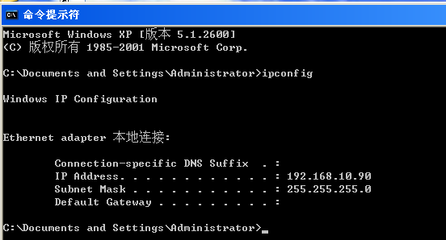
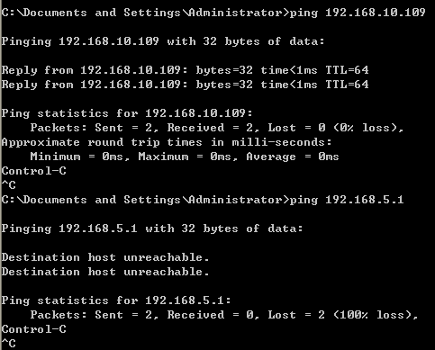

## PPPOE服务器
### 1. 系统部署基础
服务器的ip规划


角色 | IP | 网关 | 系统
---|---|---|---
PPPOE server|192.168.10.109 内网 192.168.5.109  外网	| 192.168.5.1|Linux Centos 6.8 x64
PPPOE Client	|192.168.10.90  |内网		|Xp sp3 x86
PPPOE Client	|192.168.10.80  |内网		|Centos 68 x64


### 2. 服务端搭建
#### 2.1 安装
查看是否安装所需要的包。

```
[root@mfsdata02 ppp]# rpm -qa |grep rp-pppoe
rp-pppoe-3.10-16.el6.x86_64
没有话就安装
yum install rp-pppoe
```
#### 2.2 查看配置文件
配置文件目录在/etc/ppp下

```
[root@mfsdata02 ~]# cd /etc/ppp/
[root@mfsdata02 ppp]# cp chap-secrets chap-secrets.ori
[root@mfsdata02 ppp]# cp pppoe-server-options pppoe-server-options.ori
[root@mfsdata02 ppp]# ll
total 64
-rw-------  1 root root  189 Jan 16 19:09 chap-secrets
-rw-------  1 root root   78 Jan 16 18:33 chap-secrets.ori
-rwxr-xr-x. 1 root root 2276 May 11  2016 firewall-masq
-rwxr-xr-x. 1 root root  978 May 11  2016 firewall-standalone
-rwxr-xr-x. 1 root root  386 Apr 12  2016 ip-down
-rwxr-xr-x. 1 root root 3262 Apr 12  2016 ip-down.ipv6to4
-rwxr-xr-x. 1 root root  430 Apr 12  2016 ip-up
-rwxr-xr-x. 1 root root 6517 Apr 12  2016 ip-up.ipv6to4
-rwxr-xr-x. 1 root root 1687 Apr 12  2016 ipv6-down
-rwxr-xr-x. 1 root root 3196 Apr 12  2016 ipv6-up
-rw-r--r--. 1 root root    5 Mar 16  2015 options
-rw-------. 1 root root   77 Mar 16  2015 pap-secrets
drwxr-xr-x. 2 root root 4096 Jul 13  2016 peers
-rw-r--r--  1 root root  140 Jan 16 18:33 pppoe-server-options
-rw-r--r--  1 root root  104 Jan 16 18:32 pppoe-server-options.ori
```

!!! note "备份"
    pppoe-server-options.ori 是我手动备份的文件，主要修改这两个配置文件
    
#### 2.3 修改配置文件
配置文件pppoe-server-options修改如下

```
# PPP options for the PPPoE server
# LIC: GPL
#require-pap
require-chap   #验证方式,如果选pap的话，就到pap-secrets文件中增加用户
login
lcp-echo-interval 10
lcp-echo-failure 2
ms-dns 202.106.0.20
ms-dns 8.8.8.8
```

#### 2.4 添加账号信息
添加用户，设置账户和密码
```
[root@mfsdata02 ppp]# cat chap-secrets
# Secrets for authentication using CHAP
# client	server	secret			IP addresses
cmz              *      cmz                      *
cmz2             *      cmz2                    192.168.10.3
#可以指定客户端的地址也可以不指定
```

#### 2.5 开启内核ip转发

```
[root@mfsdata02 ppp]# sed -i "s#net.ipv4.ip_forward = 0#net.ipv4.ip_forward = 1#g" /etc/sysctl.conf
[root@mfsdata02 ppp]# sysctl -p
net.ipv4.ip_forward = 1
```

#### 2.6 防火墙配置
防火墙设置，设置局域网内机器共享上网

```
[root@mfsdata02 ppp]# iptables -t nat -A POSTROUTING -o eth0 -j MASQUERADE
[root@mfsdata02 ppp]# iptables -t nat -nL
Chain PREROUTING (policy ACCEPT)
target     prot opt source               destination         

Chain POSTROUTING (policy ACCEPT)
target     prot opt source               destination         
MASQUERADE  all  --  0.0.0.0/0            0.0.0.0/0           

Chain OUTPUT (policy ACCEPT)
target     prot opt source               destination 
eth0为出口的网卡，就是可以和外网连通的那块。到现在这个pppoe服务器就可以工作了。
```

#### 2.7 启动
启动pppoe服务

```
[root@mfsdata02 ppp]# pppoe-server -I eth1 -L 192.168.10.109 -R 192.168.10.2 -N 20
```

!!! note "参数解释"
    I：指定响应PPPOE请求的端口，现在使用的eth1，也就是内网的。
    L：PPPOE服务器的IP地址，客户端连接可以看到的服务器地址，可以是任意也就是pppoe客户端的虚拟网关。
    （注意：此IP地址可以不是网卡的IP地址，而是PPPOE服务器的虚拟IP，我使用了本地的ip)
    R：这是分配给客户端的地址池起始地址，本例中从192.168.10.2开始
    N：地址池的IP地址递增几个，本例中添增10，也就是从192.168.10.2开始分配，一共分配20个IP地址


#### 2.8 配置自启动

```
[root@mfsdata02 ppp]# echo "pppoe-server -I eth1 -L 192.168.10.109 -R 192.168.10.2 -N 20" >> /etc/rc.d/rc.local

客户端连接之后此时在服务端能看到一个pppo的网络信息。注意一定要是在客户端连接之后才能看到该信息。
[root@mfsdata02 ppp]# ifconfig
eth0      Link encap:Ethernet  HWaddr 00:0C:29:87:F2:BF  
          inet addr:192.168.5.109  Bcast:192.168.5.255  Mask:255.255.255.0
          inet6 addr: fe80::20c:29ff:fe87:f2bf/64 Scope:Link
          UP BROADCAST RUNNING MULTICAST  MTU:1500  Metric:1
          RX packets:15648 errors:0 dropped:0 overruns:0 frame:0
          TX packets:10539 errors:0 dropped:0 overruns:0 carrier:0
          collisions:0 txqueuelen:1000 
          RX bytes:16369623 (15.6 MiB)  TX bytes:982976 (959.9 KiB)

eth1      Link encap:Ethernet  HWaddr 00:0C:29:87:F2:C9  
          inet addr:192.168.10.109  Bcast:192.168.10.255  Mask:255.255.255.0
          inet6 addr: fe80::20c:29ff:fe87:f2c9/64 Scope:Link
          UP BROADCAST RUNNING MULTICAST  MTU:1500  Metric:1
          RX packets:6002 errors:0 dropped:0 overruns:0 frame:0
          TX packets:814 errors:0 dropped:0 overruns:0 carrier:0
          collisions:0 txqueuelen:1000 
          RX bytes:453691 (443.0 KiB)  TX bytes:60473 (59.0 KiB)

lo        Link encap:Local Loopback  
          inet addr:127.0.0.1  Mask:255.0.0.0
          inet6 addr: ::1/128 Scope:Host
          UP LOOPBACK RUNNING  MTU:65536  Metric:1
          RX packets:23 errors:0 dropped:0 overruns:0 frame:0
          TX packets:23 errors:0 dropped:0 overruns:0 carrier:0
          collisions:0 txqueuelen:0 
          RX bytes:2160 (2.1 KiB)  TX bytes:2160 (2.1 KiB)

ppp0      Link encap:Point-to-Point Protocol  
          inet addr:192.168.10.109  P-t-P:192.168.1.3  Mask:255.255.255.255
          UP POINTOPOINT RUNNING NOARP MULTICAST  MTU:1480  Metric:1
          RX packets:2184 errors:0 dropped:0 overruns:0 frame:0
          TX packets:471 errors:0 dropped:0 overruns:0 carrier:0
          collisions:0 txqueuelen:3 
          RX bytes:130073 (127.0 KiB)  TX bytes:28127 (27.4 KiB)

```

### 3. windows 客户端测试
找其他机器测试
#### 3.1 拨号之前检查
客户端拨号流程




#### 3.2 拨号


选择客户端拨号登录测试


#### 3.3 拨号后检查


```
以下是dos命令行，详细测试过程：

没有拨号之前操作

Microsoft Windows XP [版本 5.1.2600]
(C) 版权所有 1985-2001 Microsoft Corp.

C:\Documents and Settings\Administrator>ipconfig

Windows IP Configuration


Ethernet adapter 本地连接:

        Connection-specific DNS Suffix  . :
        IP Address. . . . . . . . . . . . : 192.168.10.90   #本地就是之前内网的地址
        Subnet Mask . . . . . . . . . . . : 255.255.255.0
        Default Gateway . . . . . . . . . :

C:\Documents and Settings\Administrator>ping 192.168.10.109  #可以ping通pppoe服务器端内网的地址

Pinging 192.168.10.109 with 32 bytes of data:

Reply from 192.168.10.109: bytes=32 time<1ms TTL=64
Reply from 192.168.10.109: bytes=32 time<1ms TTL=64

Ping statistics for 192.168.10.109:
    Packets: Sent = 2, Received = 2, Lost = 0 (0% loss),
Approximate round trip times in milli-seconds:
    Minimum = 0ms, Maximum = 0ms, Average = 0ms
Control-C
^C
C:\Documents and Settings\Administrator>ping 192.168.5.1   #虽然能ping通pppoe内网地址但是ping不同pppoe服务端外网地址网关地址，此时还没有拨号

Pinging 192.168.5.1 with 32 bytes of data:

Destination host unreachable.
Destination host unreachable.

Ping statistics for 192.168.5.1:
    Packets: Sent = 2, Received = 0, Lost = 2 (100% loss),
Control-C
^C
没有拨号之后操作

C:\Documents and Settings\Administrator>ping 192.168.5.1

Pinging 192.168.5.1 with 32 bytes of data:

Reply from 192.168.5.1: bytes=32 time=8ms TTL=127
Reply from 192.168.5.1: bytes=32 time=15ms TTL=127

Ping statistics for 192.168.5.1:
    Packets: Sent = 2, Received = 2, Lost = 0 (0% loss),
Approximate round trip times in milli-seconds:
    Minimum = 8ms, Maximum = 15ms, Average = 11ms
Control-C
^C
C:\Documents and Settings\Administrator>ping 192.168.10.109

Pinging 192.168.10.109 with 32 bytes of data:

Reply from 192.168.10.109: bytes=32 time=3ms TTL=64
Reply from 192.168.10.109: bytes=32 time=14ms TTL=64

Ping statistics for 192.168.10.109:
    Packets: Sent = 2, Received = 2, Lost = 0 (0% loss),
Approximate round trip times in milli-seconds:
    Minimum = 3ms, Maximum = 14ms, Average = 8ms
Control-C
^C
C:\Documents and Settings\Administrator>ipconfig

Windows IP Configuration


Ethernet adapter 本地连接:

        Connection-specific DNS Suffix  . :
        IP Address. . . . . . . . . . . . : 192.168.10.90
        Subnet Mask . . . . . . . . . . . : 255.255.255.0
        Default Gateway . . . . . . . . . :

PPP adapter 宽带连接:                       #拨号成功后就会发现有个ppp客户端产生，拨号之前是没有的

        Connection-specific DNS Suffix  . :
        IP Address. . . . . . . . . . . . : 10.67.15.18
        Subnet Mask . . . . . . . . . . . : 255.255.255.255
        Default Gateway . . . . . . . . . : 10.67.15.18

C:\Documents and Settings\Administrator>ping baidu.com  #拨号成功后，可以正常上网

Pinging baidu.com [180.149.132.47] with 32 bytes of data:

Reply from 180.149.132.47: bytes=32 time=41ms TTL=54

Ping statistics for 180.149.132.47:
    Packets: Sent = 1, Received = 1, Lost = 0 (0% loss),
Approximate round trip times in milli-seconds:
    Minimum = 41ms, Maximum = 41ms, Average = 41ms
Control-C
^C
```

### 4. linux 客户端测试
客户端选择centos，拨号上网，操作过程如下：
#### 4.1 拨号之前操作检查

```
[root@mfsdata01 ~]# cat /etc/issue
CentOS release 6.8 (Final)
Kernel \r on an \m

[root@mfsdata01 ~]# uname -a
Linux mfsdata01 2.6.32-642.6.2.el6.x86_64 #1 SMP Wed Oct 26 06:52:09 UTC 2016 x86_64 x86_64 x86_64 GNU/Linux

[root@mfsdata01 ~]# ifconfig
eth0      Link encap:Ethernet  HWaddr 00:0C:29:F1:FB:05  
          inet addr:192.168.10.80  Bcast:192.168.10.255  Mask:255.255.255.0
          inet6 addr: fe80::20c:29ff:fef1:fb05/64 Scope:Link
          UP BROADCAST RUNNING MULTICAST  MTU:1500  Metric:1
          RX packets:30766 errors:0 dropped:0 overruns:0 frame:0
          TX packets:9953 errors:0 dropped:0 overruns:0 carrier:0
          collisions:0 txqueuelen:1000 
          RX bytes:18534315 (17.6 MiB)  TX bytes:638381 (623.4 KiB)

lo        Link encap:Local Loopback  
          inet addr:127.0.0.1  Mask:255.0.0.0
          inet6 addr: ::1/128 Scope:Host
          UP LOOPBACK RUNNING  MTU:65536  Metric:1
          RX packets:8 errors:0 dropped:0 overruns:0 frame:0
          TX packets:8 errors:0 dropped:0 overruns:0 carrier:0
          collisions:0 txqueuelen:0 
          RX bytes:480 (480.0 b)  TX bytes:480 (480.0 b)
此时只可以ping通pppoeserver内网的地址，如下：
[root@mfsdata01 ~]# ping 192.168.10.109 -c 1
PING 192.168.10.109 (192.168.10.109) 56(84) bytes of data.
64 bytes from 192.168.10.109: icmp_seq=1 ttl=64 time=0.300 ms

--- 192.168.10.109 ping statistics ---
1 packets transmitted, 1 received, 0% packet loss, time 0ms
rtt min/avg/max/mdev = 0.300/0.300/0.300/0.000 ms
[root@mfsdata01 ~]# ping 192.168.5.1 -c 1
connect: Network is unreachable
[root@mfsdata01 ~]# ping baidu.com -c 1
ping: unknown host baidu.com
```

#### 4.2 建立PPPoe链接

```
[root@mfsdata01 ~]# adsl-setup  # < 建立ADSL连接我的是第二次重新配置
Welcome to the PPPoE client setup.  First, I will run some checks on
your system to make sure the PPPoE client is installed properly...

The following DSL config was found on your system:

  Device:      Name:
  ppp0         DSLppp0

Please enter the device if you want to configure the present DSL config
(default ppp0) or enter 'n' if you want to create a new one: n

LOGIN NAME

Enter your Login Name: cmz #输入ADSL连接的用户名

INTERFACE

Enter the Ethernet interface connected to the PPPoE modem
For Solaris, this is likely to be something like /dev/hme0.
For Linux, it will be ethX, where 'X' is a number.
(default eth0):  #指定网络设备

Do you want the link to come up on demand, or stay up continuously?
If you want it to come up on demand, enter the idle time in seconds
after which the link should be dropped.  If you want the link to
stay up permanently, enter 'no' (two letters, lower-case.)
NOTE: Demand-activated links do not interact well with dynamic IP
addresses.  You may have some problems with demand-activated links.
Enter the demand value (default no):  #接受默认设置

DNS

Please enter the IP address of your ISP's primary DNS server.
If your ISP claims that 'the server will provide dynamic DNS addresses',
enter 'server' (all lower-case) here. #输入DNS地址，不输入不能解析
If you just press enter, I will assume you know what you are
doing and not modify your DNS setup.
Enter the DNS information here: 114.114.114.114     
Please enter the IP address of your ISP's secondary DNS server.
If you just press enter, I will assume there is only one DNS server.
Enter the secondary DNS server address here: 8.8.8.8

PASSWORD

Please enter your Password:          #此时输入ADSL账号cmz对应的密码 也是cmz
Please re-enter your Password:       #再输入一次

USERCTRL

Please enter 'yes' (three letters, lower-case.) if you want to allow
normal user to start or stop DSL connection (default yes): no #填入NO，不允许一般的用户连接PPPoE

FIREWALLING

Please choose the firewall rules to use.  Note that these rules are
very basic.  You are strongly encouraged to use a more sophisticated
firewall setup; however, these will provide basic security.  If you
are running any servers on your machine, you must choose 'NONE' and
set up firewalling yourself.  Otherwise, the firewall rules will deny
access to all standard servers like Web, e-mail, ftp, etc.  If you
are using SSH, the rules will block outgoing SSH connections which
allocate a privileged source port.

The firewall choices are:
0 - NONE: This script will not set any firewall rules.  You are responsible
          for ensuring the security of your machine.  You are STRONGLY
          recommended to use some kind of firewall rules.
1 - STANDALONE: Appropriate for a basic stand-alone web-surfing workstation
2 - MASQUERADE: Appropriate for a machine acting as an Internet gateway
                for a LAN
Choose a type of firewall (0-2): 0  #输入0，不在这里设置防火墙

Start this connection at boot time

Do you want to start this connection at boot time?
Please enter no or yes (default no):yes #填yes,系统启动自动连接ADSL

** Summary of what you entered **

Ethernet Interface: eth0
User name:          cmz
Activate-on-demand: No
Primary DNS:        114.114.114.114
Secondary DNS:      8.8.8.8
Firewalling:        NONE
User Control:       no
Accept these settings and adjust configuration files (y/n)? y
Adjusting /etc/sysconfig/network-scripts/ifcfg-ppp1
Adjusting /etc/resolv.conf
  (But first backing it up to /etc/resolv.conf.bak)
Adjusting /etc/ppp/chap-secrets and /etc/ppp/pap-secrets
  (But first backing it up to /etc/ppp/chap-secrets.bak)
  (But first backing it up to /etc/ppp/pap-secrets.bak)


Congratulations, it should be all set up!

Type '/sbin/ifup ppp1' to bring up your xDSL link and '/sbin/ifdown ppp1'
to bring it down.
Type '/sbin/pppoe-status /etc/sysconfig/network-scripts/ifcfg-ppp1'
to see the link status.

[root@mfsdata01 ~]# adsl-start   #启动adsl
[root@mfsdata01 ~]#  #← 稍等片刻后若启动成功后出现提示符（无任何提示即意味着连接成功）

这时，通过“ifconfig”命令可以看到各网络接口的信息（IP地址等等）。

[root@mfsdata01 ~]# ifconfig
eth0      Link encap:Ethernet  HWaddr 00:0C:29:F1:FB:05  
          inet addr:192.168.10.80  Bcast:192.168.10.255  Mask:255.255.255.0
          inet6 addr: fe80::20c:29ff:fef1:fb05/64 Scope:Link
          UP BROADCAST RUNNING MULTICAST  MTU:1500  Metric:1
          RX packets:31553 errors:0 dropped:0 overruns:0 frame:0
          TX packets:10328 errors:0 dropped:0 overruns:0 carrier:0
          collisions:0 txqueuelen:1000 
          RX bytes:18597215 (17.7 MiB)  TX bytes:688437 (672.3 KiB)

lo        Link encap:Local Loopback  
          inet addr:127.0.0.1  Mask:255.0.0.0
          inet6 addr: ::1/128 Scope:Host
          UP LOOPBACK RUNNING  MTU:65536  Metric:1
          RX packets:8 errors:0 dropped:0 overruns:0 frame:0
          TX packets:8 errors:0 dropped:0 overruns:0 carrier:0
          collisions:0 txqueuelen:0 
          RX bytes:480 (480.0 b)  TX bytes:480 (480.0 b)

ppp0      Link encap:Point-to-Point Protocol  
          inet addr:10.67.15.20  P-t-P:192.168.10.109  Mask:255.255.255.255
          UP POINTOPOINT RUNNING NOARP MULTICAST  MTU:1492  Metric:1
          RX packets:3 errors:0 dropped:0 overruns:0 frame:0
          TX packets:11 errors:0 dropped:0 overruns:0 carrier:0
          collisions:0 txqueuelen:3 
          RX bytes:30 (30.0 b)  TX bytes:1086 (1.0 KiB)

[root@mfsdata01 ~]# ping baidu.com
PING baidu.com (180.149.132.47) 56(84) bytes of data.
64 bytes from 180.149.132.47: icmp_seq=1 ttl=54 time=29.6 ms
64 bytes from 180.149.132.47: icmp_seq=2 ttl=54 time=34.8 ms
^C
--- baidu.com ping statistics ---
2 packets transmitted, 2 received, 0% packet loss, time 1630ms
rtt min/avg/max/mdev = 29.611/32.248/34.885/2.637 ms 
```

