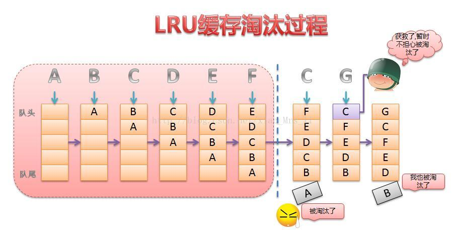
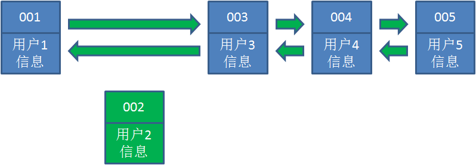
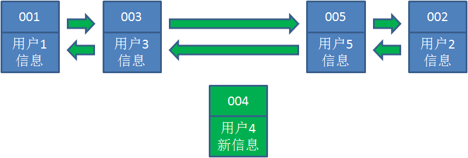

## 1. 介绍
&#160; &#160; &#160; &#160;内存管理的一种页面置换算法，对于在内存中但又不用的数据块（内存块）叫做LRU，操作系统会根据哪些数据属于LRU而将其移出内存而腾出空间来加载另外的数据。

&#160; &#160; &#160; &#160;什么是LRU算法？ LRU是Least Recently Used的缩写，即最近最少使用，常用于页面置换算法，是为虚拟页式存储管理服务的。



### 1.1 原理
&#160; &#160; &#160; &#160;算法根据数据的历史访问记录来进行淘汰数据，其核心思想是“如果数据最近被访问过，那么将来被访问的几率也更高”。

### 1.2 实现
&#160; &#160; &#160; &#160;最常见的实现是使用一个链表保存缓存数据，详细算法实现如下：
1. 新数据插入到链表头部；

2. 每当缓存命中（即缓存数据被访问），则将数据移到链表头部；

3. 当链表满的时候，将链表尾部的数据丢弃。

### 1.3 分析
#### 1.3.1 命中率
&#160; &#160; &#160; &#160;当存在热点数据时，LRU的效率很好，但偶发性的、周期性的批量操作会导致LRU命中率急剧下降，缓存污染情况比较严重。

#### 1.3.2 复杂度

&#160; &#160; &#160; &#160;实现简单。

#### 1.3.3 开销

&#160; &#160; &#160; &#160;命中时需要遍历链表，找到命中的数据块索引，然后需要将数据移到头部。

## 2. 详细解释过程
### 2.1 哈希表
&#160; &#160; &#160; &#160;什么是哈希链表呢？

&#160; &#160; &#160; &#160;我们都知道，哈希表是由若干个Key-Value所组成。在“逻辑”上，这些Key-Value是无所谓排列顺序的，谁先谁后都一样。

 

&#160; &#160; &#160; &#160;在哈希链表当中，这些Key-Value不再是彼此无关的存在，而是被一个链条串了起来。每一个Key-Value都具有它的前驱Key-Value、后继Key-Value，就像双向链表中的节点一样。

 

这样一来，原本无序的哈希表拥有了固定的排列顺序。

### 2.2 解释LRU过程
&#160; &#160; &#160; &#160;让我们以用户信息的需求为例，来演示一下LRU算法的基本思路：

1.假设我们使用哈希链表来缓存用户信息，目前缓存了4个用户，这4个用户是按照时间顺序依次从链表右端插入的。

 

2.此时，业务方访问用户5，由于哈希链表中没有用户5的数据，我们从数据库中读取出来，插入到缓存当中。这时候，链表中最右端是最新访问到的用户5，最左端是最近最少访问的用户1。


 


3.接下来，业务方访问用户2，哈希链表中存在用户2的数据，我们怎么做呢？我们把用户2从它的前驱节点和后继节点之间移除，重新插入到链表最右端。这时候，链表中最右端变成了最新访问到的用户2，最左端仍然是最近最少访问的用户1。

 
 


4.接下来，业务方请求修改用户4的信息。同样道理，我们把用户4从原来的位置移动到链表最右侧，并把用户信息的值更新。这时候，链表中最右端是最新访问到的用户4，最左端仍然是最近最少访问的用户1。

 
 

5.后来业务方换口味了，访问用户6，用户6在缓存里没有，需要插入到哈希链表。假设这时候缓存容量已经达到上限，必须先删除最近最少访问的数据，那么位于哈希链表最左端的用户1就会被删除掉，然后再把用户6插入到最右端。

 
 

以上，就是LRU算法的基本思路。

## 3. python code

```
class LRUcache:
    def __init__(self, size=3):
        self.cache = {}
        self.keys = []
        self.size = size

    def get(self, key):
        if key in self.cache:
            self.keys.remove(key)
            self.keys.insert(0, key)
            return self.cache[key]
        else:
            return None

    def set(self, key, value):
        if key in self.cache:
            self.keys.remove(key)
            self.keys.insert(0, key)
            self.cache[key] = value
        elif len(self.keys) == self.size:
            old = self.keys.pop()
            self.cache.pop(old)
            self.keys.insert(0, key)
            self.cache[key] = value
        else:
            self.keys.insert(0, key)
            self.cache[key] = value

if __name__ == '__main__':
    LRUcache = LRUcache()
    LRUcache.set('key_name','summer')
    LRUcache.set('key_age',30)
    LRUcache.set('key_job','IT')
    LRUcache.set('key_salary',20000)
    LRUcache.set('key_hobby','apple')
    LRUcache.set('key_love','keke')
    LRUcache.set('key_name','cmz')

    print("key_name = ",LRUcache.get('key_name'))
    print("key_age = ",LRUcache.get('key_age'))
    print("key_job = ",LRUcache.get('key_job'))
    print("key_salary = ",LRUcache.get('key_salary'))
    print("key_hobby = ",LRUcache.get('key_hobby'))
    print("key_love = ",LRUcache.get('key_love'))
    
```
运行结果

```
root@leco:~/code/lru# python lru_demo.py
key_name =  cmz
key_age =  None
key_job =  None
key_salary =  None
key_hobby =  apple
key_love =  keke
```

